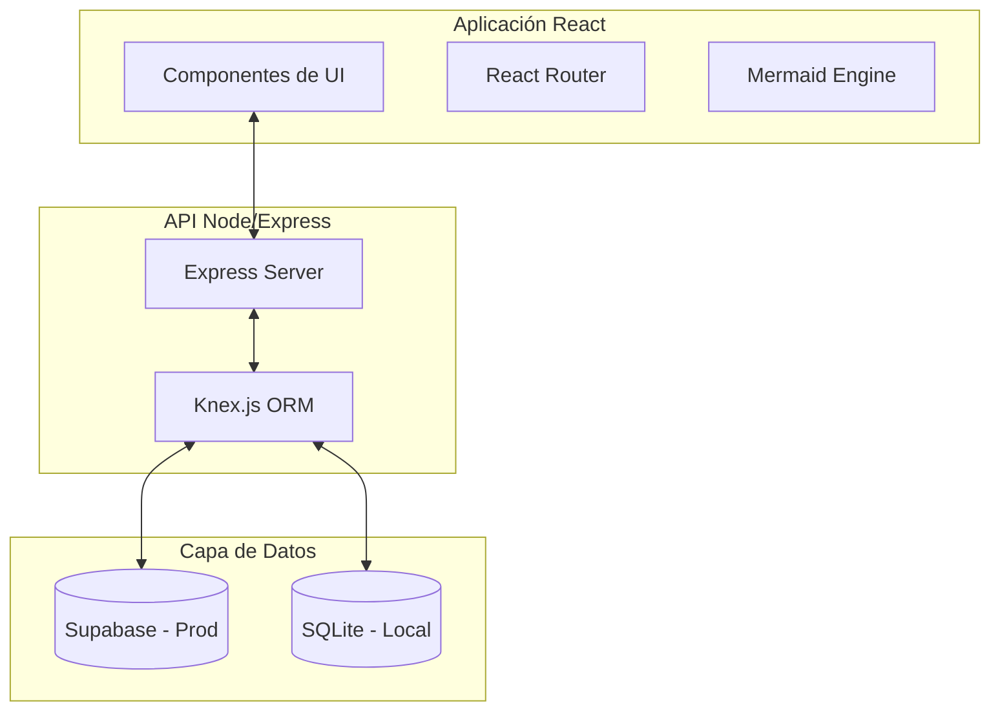

# Plataforma de Portafolio para Ingeniería de Datos


Esta aplicación es una plataforma full-stack diseñada específicamente para profesionales de datos que necesitan mostrar arquitecturas complejas, pipelines de ETL y métricas de impacto de una manera visualmente impactante y técnica.

---

## Características de la Plataforma

### 1. Sistema de Gestión de Contenidos (CMS)

- **API Modular**: Backend basado en Express.js que gestiona dinámicamente proyectos y configuraciones globales.
- **Persistencia Flexible**: Soporte para **PostgreSQL (Supabase)** en producción y **SQLite** para desarrollo rápido local.
- **Control de Versiones de Esquema**: Implementación de migraciones y semillas con **Knex.js** para garantizar la consistencia de los datos.

### 2. Visualización Técnica Avanzada

- **Diagramas de Arquitectura Dinámicos**: Integración con **Mermaid.js** para renderizar flujos de datos directamente desde definiciones en texto plano.
- **Análisis Detallado**: Capacidad para desglosar retos, soluciones e hitos técnicos en cada caso de estudio.
- **Teaser de Código**: Resaltado de fragmentos de código clave para demostrar la implementación técnica de los pipelines.

### 3. Interfaz de Usuario de Alto Rendimiento

- **React 19 + Vite**: Una Single Page Application (SPA) optimizada para tiempos de carga mínimos.
- **Diseño Responsivo y Estético**: Construido con **Tailwind CSS** y **Framer Motion** para micro-interacciones suaves.
- **Visualización de Red**: Componentes interactivos para mostrar la expertise técnica y conexiones de herramientas.

---

## Arquitectura del Sistema

La plataforma sigue una arquitectura de desacoplamiento entre el cliente y el servidor:



---

## Tecnologías Utilizadas

### Core

- **Frontend**: `React 19`, `Vite`, `Tailwind CSS 4`, `React Zoom Pan Pinch`.
- **Backend**: `Node.js`, `Express`, `Knex.js`.
- **Base de Datos**: `PostgreSQL (Supabase)`, `SQLite`.

### Herramientas de Visualización

- **Arquitectura**: `Mermaid.js`.
- **Animaciones**: `Framer Motion`.

---

## Guía de Inicio Rápido (Local)

### Configuración del Entorno

1. **Instalar dependencias del Backend**:

   ```bash
   cd backend
   npm install
   ```

2. **Preparar la Base de Datos Local**:

   ```bash
   npx knex migrate:latest
   npx knex seed:run
   ```

3. **Instalar dependencias del Frontend**:

   ```bash
   cd ../frontend
   npm install
   ```

### Ejecución

- **Servidor Backend**: En `/backend`, ejecuta `npm start`.
- **Aplicación Frontend**: En `/frontend`, ejecuta `npm run dev`.

---

## Organización del Código

- `/frontend/src/features/portfolio`: Contiene la lógica y componentes principales de visualización.
- `/backend/migrations`: Definiciones de la estructura de la base de datos.
- `/backend/seeds`: Contenido demostrativo para popular el portafolio.

---

## Licencia

Este proyecto se distribuye bajo la licencia **MIT**.

---

*Este software ha sido desarrollado para estandarizar la presentación de proyectos técnicos de ingeniería de datos.*
